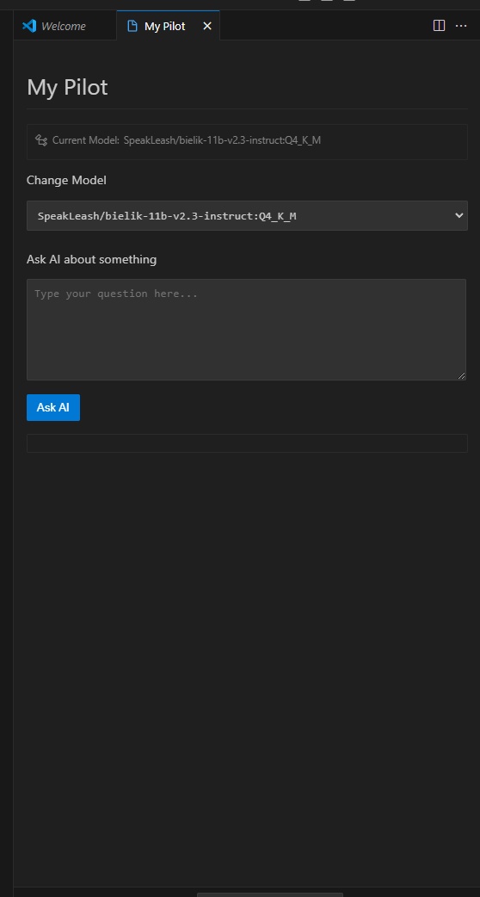

# mypilot README

This is the README for your extension "mypilot", an AI assistant extension that integrates with locally running Ollama models.

## Features

### Local AI Model Selection
This extension allows you to use your locally available Ollama models directly within VS Code:
- View all locally available Ollama models
- Select your preferred model for AI assistance

> Tip: You can switch between different models anytime using the model picker dropdown in the extension sidebar.

## Requirements

- VS Code 1.60.0 or higher
- [Ollama](https://ollama.ai/) installed and running locally on your machine
- At least one model pulled into your Ollama installation

## Extension Settings

This extension contributes the following settings:

* `mypilot.enable`: Enable/disable this extension.

## Following extension guidelines

Ensure that you've read through the extensions guidelines and follow the best practices for creating your extension.

* [Extension Guidelines](https://code.visualstudio.com/api/references/extension-guidelines)

